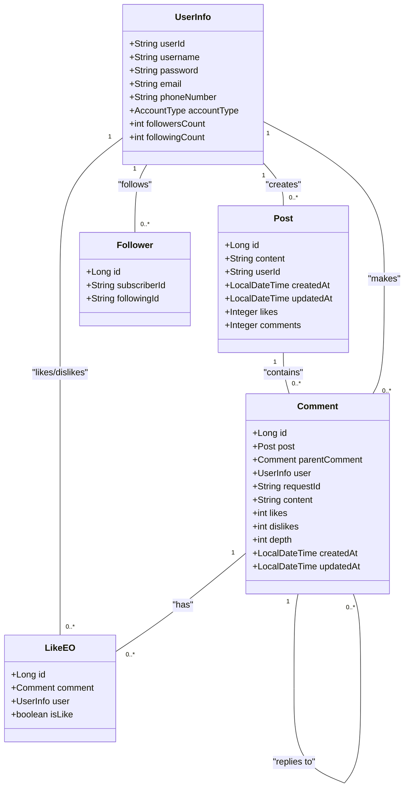

```mermaid 
classDiagram
    class UserInfo {
        +String userId
        +String username
        +String password
        +String email
        +String phoneNumber
        +AccountType accountType
        +int followersCount
        +int followingCount
    }

    class Post {
        +Long id
        +String content
        +String userId
        +LocalDateTime createdAt
        +LocalDateTime updatedAt
        +Integer likes
        +Integer comments
    }

    class Comment {
        +Long id
        +Post post
        +Comment parentComment
        +UserInfo user
        +String requestId
        +String content
        +int likes
        +int dislikes
        +int depth
        +LocalDateTime createdAt
        +LocalDateTime updatedAt
    }

    class LikeEO {
        +Long id
        +Comment comment
        +UserInfo user
        +boolean isLike
    }

    class Follower {
        +Long id
        +String subscriberId
        +String followingId
    }

    UserInfo "1" -- "0..*" Post : "creates"
    Post "1" -- "0..*" Comment : "contains"
    Comment "1" -- "0..*" Comment : "replies to"
    UserInfo "1" -- "0..*" Comment : "makes"
    UserInfo "1" -- "0..*" LikeEO : "likes/dislikes"
    Comment "1" -- "0..*" LikeEO : "has"
    UserInfo "1" -- "0..*" Follower : "follows"

```