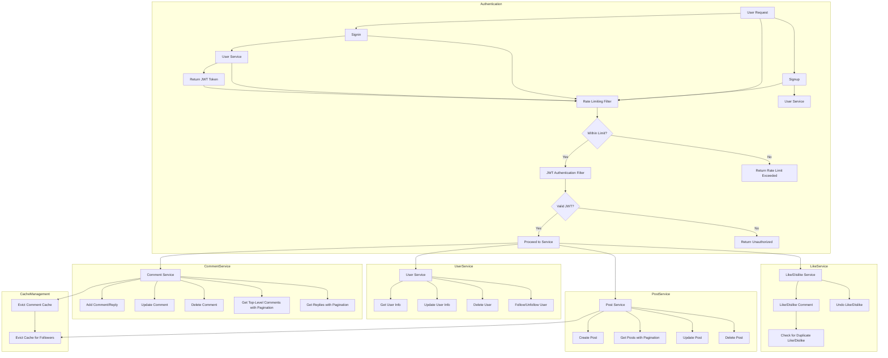

```mermaid
flowchart TD
    subgraph Authentication
        A[User Request] --> K[Rate Limiting Filter]
        K --> L{Within Limit?}
        L -- Yes --> B[JWT Authentication Filter]
        L -- No --> N[Return Rate Limit Exceeded]

        B --> C{Valid JWT?}
        C -- Yes --> D[Proceed to Service]
        C -- No --> E[Return Unauthorized]
        A --> F[Signup]
        A --> G[Signin]
        G --> H[User Service]
        H --> I[Return JWT Token]
        F --> J[User Service]
    end

    subgraph UserService
        D --> O[User Service]
        O --> P[Get User Info]
        O --> Q[Update User Info]
        O --> R[Delete User]
        O --> Y[Follow/Unfollow User]
    end

    subgraph PostService
        D --> S[Post Service]
        S --> T[Create Post]
        S --> U[Get Posts with Pagination]
        S --> V[Update Post]
        S --> W[Delete Post]
    end

    subgraph CommentService
        D --> C1[Comment Service]
        C1 --> C2[Add Comment/Reply]
        C1 --> C3[Update Comment]
        C1 --> C4[Delete Comment]
        C1 --> C5[Get Top-Level Comments with Pagination]
        C1 --> C6[Get Replies with Pagination]
    end

    subgraph LikeService
        D --> L1[Like/Dislike Service]
        L1 --> L2[Like/Dislike Comment]
        L2 --> L3[Check for Duplicate Like/Dislike]
        L1 --> L4[Undo Like/Dislike]
    end

    subgraph CacheManagement
        S --> X[Evict Cache for Followers]
        C1 --> C7[Evict Comment Cache]
        C7 --> X
    end

    F --> K
    G --> K
    H --> K
    I --> K


```